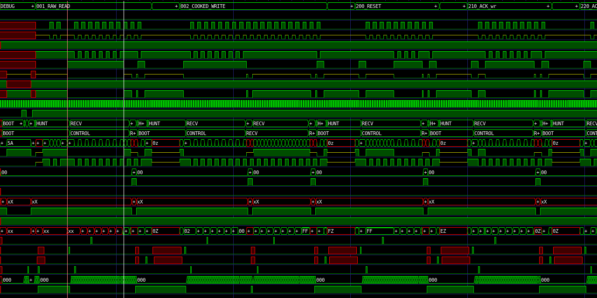

:url-base: http://dlmiles.github.io/tt05-i2c-bert/
:url-html: http://dlmiles.github.io/tt05-i2c-bert/docs/asciidoc/
:url-pdf: http://dlmiles.github.io/tt05-i2c-bert/docs/asciidoc.pdf
:url-docbook: http://dlmiles.github.io/tt05-i2c-bert/docs/asciidoc.xml
:notes-tt05: notes-tt05.html

= TT05 I2C (BERT) Bit Error Rate Tester / Echo ALU Peripheral

* link:tt05/notes[Notes]

* link:tt05/project-outline[Project outline]

* link:tt05/design-goals-and-limits[Design goals and limits]

* link:tt05/i2c-command-structure[I2C Command structure]

* link:tt05/rp2040-code-snippets-and-firmware[RP4020 code snippets and firmware]

* Wavedrom integration test

ifdef::wavedrom-available[]
[wavedrom, target=sample_wavedrom_png, format=png]
....
{signal: [
  {name: 'clk',    wave: '10101010101010101010101010101010101', node: ''},
  {name: 'stb',    wave: '0.......1.0.......1.0.......1.0....', node: ''},
  {},
  {name: 'out1a',  wave: '10101010.101010101.010101010.101010', node: ''},
  {name: 'out2a',  wave: '101010101.010101010.101010101.01010', node: ''},
  {name: 'out3a',  wave: '1010101010.101010101.010101010.1010', node: ''},
  {},
  {name: 'out1b',  wave: '01010101.010101010.101010101.010101', node: ''},
  {name: 'out2b',  wave: '010101010.101010101.010101010.10101', node: ''},
  {name: 'out3b',  wave: '0101010101.010101010.101010101.0101', node: ''},
],
foot:{
   text:'Sample Wavedrom Ignore',
   tock:0
 },
}
....
endif::[]
ifndef::wavedrom-available[]
Your renderer does not support 'wavedrom-available'
endif::[]

* Graphviz integration test

ifdef::graphviz-available[]
["graphviz", "sample_graphviz_png", "png"]
....
digraph finite_state_machine {
  rankdir=LR;
  size="8,5"
  node [shape = doublecircle]; LR_0 LR_3 LR_4 LR_8;
  node [shape = circle];
  LR_0 -> LR_2 [ label = "SS(B)" ];
  LR_0 -> LR_1 [ label = "SS(S)" ];
  LR_1 -> LR_3 [ label = "S($end)" ];
  LR_2 -> LR_6 [ label = "SS(b)" ];
  LR_2 -> LR_5 [ label = "SS(a)" ];
  LR_2 -> LR_4 [ label = "S(A)" ];
  LR_5 -> LR_7 [ label = "S(b)" ];
  LR_5 -> LR_5 [ label = "S(a)" ];
  LR_6 -> LR_6 [ label = "S(b)" ];
  LR_6 -> LR_5 [ label = "S(a)" ];
  LR_7 -> LR_8 [ label = "S(b)" ];
  LR_7 -> LR_5 [ label = "S(a)" ];
  LR_8 -> LR_6 [ label = "S(b)" ];
  LR_8 -> LR_5 [ label = "S(a)" ];
}
....
endif::[]
ifndef::graphviz-available[]
Your renderer does not support 'graphviz-available'
endif::[]

.Image VCD Dump Sample

'''

{url-html}[HTML] {url-pdf}[PDF] {url-docbook}[DocBook]
